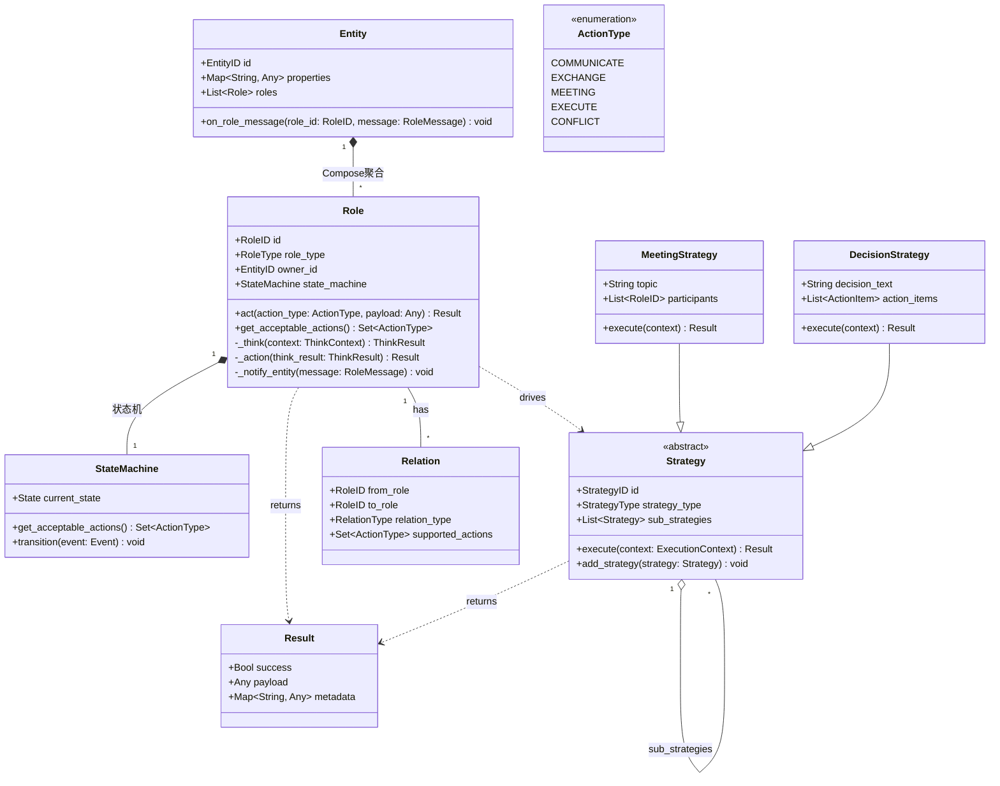
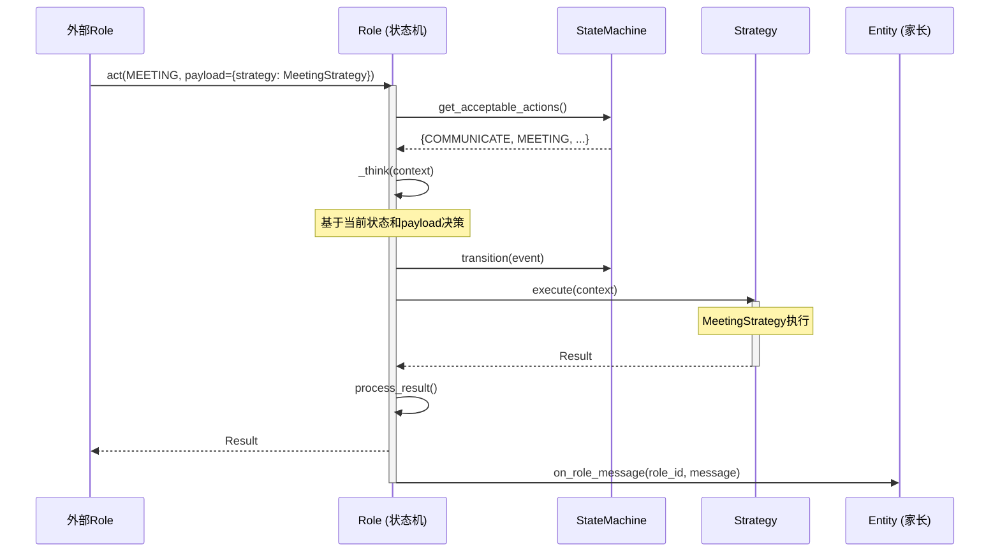
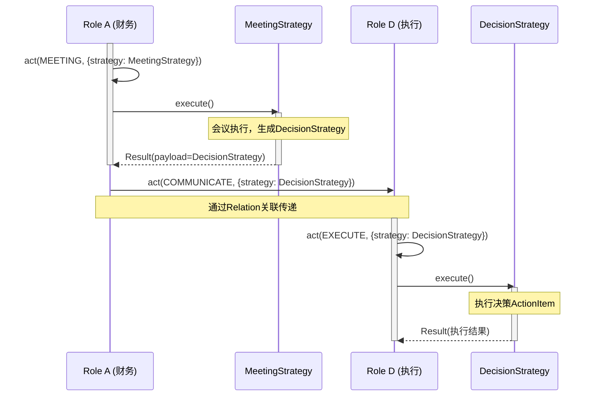
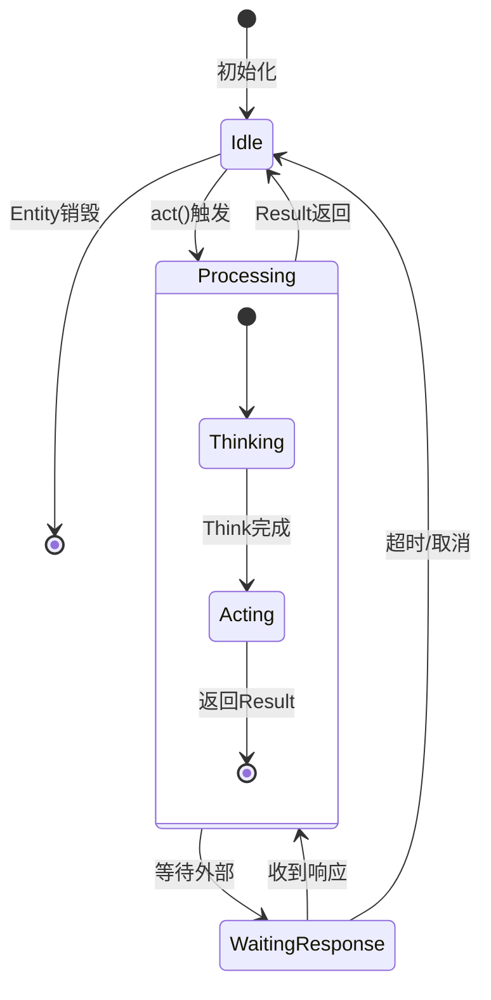
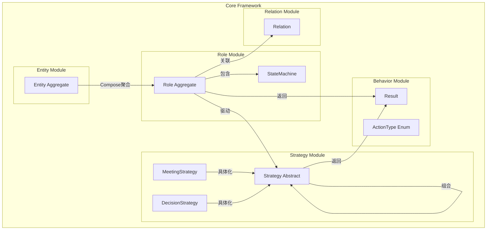
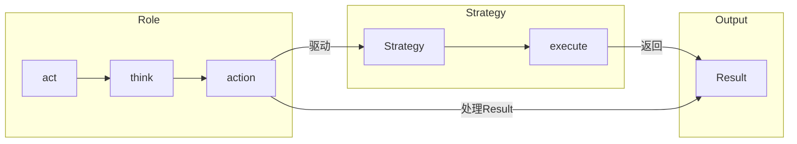

# Phase 1: 核心抽象层基础 - Context

**Gathered:** 2026-04-13
**Status:** Ready for planning

---

<domain>
## Phase Boundary

建立领域无关的核心抽象层，定义双聚合根模型（Entity+Role），实现绝对抽象的实体关系行为传导网络框架基础。

本阶段交付：
- Entity（聚合根，Compose聚合Role，接收Role消息）
- Role（聚合根，状态机，内部Act→Think→Action驱动）
- ActionType（枚举，可扩展）
- Action（内部行为，驱动Strategy执行，返回Result）
- Result（Action执行结果，payload可包含Strategy）
- Strategy（策略对象，组合模式，由Action驱动执行）
- Relation（Role间关联关系）
- StateStorage（存储抽象）

</domain>

---

<decisions>
## Implementation Decisions

### D-01: 双聚合根 + Compose聚合
**决策：** Entity和Role都是聚合根，Entity通过Compose聚合Role

- **Entity作为聚合根**：
  - **Compose聚合**多个Role（直接包含Role对象，不是引用）
  - 统一接收内部Role消息（`on_role_message`）
  - 不负责外部消息转发，不负责Role间关系管理

- **Role作为聚合根**：
  - 独立的生命周期，但由Entity Compose聚合
  - 自主管理与外部Role的关联关系（Relation）
  - 内部状态机驱动行为（Act→Think→Action）
  - 直接与其他Role交互（通过Relation）

### D-02: Role状态机模型
**决策：** Role本质是状态机，状态决定可接受ActionType

- Role有当前状态（State）
- 状态决定可接受的ActionType集合
- `get_acceptable_actions()` 查询当前可接受ActionType
- Act是外部触发入口，内部驱动Think→Action

### D-03: Act→Think→Action内部行为链
**决策：** Act、Think、Action都是Role内部行为，不是外部操作

| 阶段 | 类型 | 职责 |
|------|------|------|
| **Act** | 外部触发入口 | 接收ActionType和payload，返回Result |
| **Think** | 内部行为 | 基于当前状态和输入进行决策，可能更新状态 |
| **Action** | 内部行为 | 执行决策，驱动Strategy执行，返回Result |

### D-04: Result对象作为Action返回
**决策：** `act()`方法返回Result对象，不是Strategy

```python
class Result:
    success: bool
    payload: Any      # 可以是Strategy、数据、或其他Result
    metadata: dict    # 执行元信息
```

- Action执行返回Result
- Strategy通过Action的payload传递
- 无独立的receive_strategy方法

### D-05: Strategy组合模式 + Action驱动执行
**决策：** Strategy采用组合模式，由Action驱动执行

```
Action驱动Strategy执行：
  Role.act(MEETING, payload={"strategy": MeetingStrategy})
    ↓
  Action内部驱动MeetingStrategy.execute()
    ↓
  MeetingStrategy返回Result
    ↓
  Action处理Result，返回新的Result

Strategy组合模式：
  MeetingStrategy
    └─ DecisionStrategy (sub_strategy)
         └─ ActionItemStrategy
```

- Strategy不由Action生成，而是由Action驱动执行
- Strategy可以包含子Strategy（组合模式）
- Strategy执行返回Result
- Action接收Strategy的Result，处理后返回新的Result

### D-06: Strategy通过Action payload传递
**决策：** Strategy通过Action的payload传递，无独立接收方法

```python
# 传递Strategy示例
result = role_a.act(ActionType.COMMUNICATE, {
    "target": role_d,
    "strategy": decision_strategy  # Strategy通过payload传递
})
```

### D-07: ActionType可扩展枚举
**决策：** ActionType是可扩展枚举

```python
class ActionType(Enum):
    COMMUNICATE = "communicate"      # 单向通信
    EXCHANGE = "exchange"            # 双向交换
    MEETING = "meeting"              # 多方会议（驱动MeetingStrategy）
    EXECUTE = "execute"              # 执行Strategy
    CONFLICT = "conflict"            # 对抗/竞争
    # 领域可扩展...
```

### D-08: Relation约束Action
**决策：** 只有存在关联的Role才能交互，关联决定可执行ActionType

- 检查状态是否接受ActionType
- 检查与from_role是否存在支持该Action的Relation

</decisions>

---

<architecture>
## Core Architecture

### 类图：双聚合根 + Result返回



### 时序图：Act→Think→Action→Result



### 时序图：Strategy传递与执行



### 状态图：Role状态机



### 组件图



### 数据流图：Action→Strategy→Result



</architecture>

---

<specifics>
## 具体设计规范

### Entity接口定义

```python
class Entity(ABC):
    """聚合根：Compose聚合Role，统一接收Role消息"""
    
    @property
    @abstractmethod
    def entity_id(self) -> EntityID: pass
    
    @property
    @abstractmethod
    def properties(self) -> dict[str, Any]: pass
    
    @property
    @abstractmethod
    def roles(self) -> list[Role]: pass
    
    @abstractmethod
    def on_role_message(self, role_id: RoleID, message: RoleMessage) -> None: pass
```

### Role接口定义

```python
class Role(ABC):
    """聚合根：状态机，Act→Think→Action驱动"""
    
    @property
    @abstractmethod
    def role_id(self) -> RoleID: pass
    
    @property
    @abstractmethod
    def state_machine(self) -> StateMachine: pass
    
    @abstractmethod
    def get_acceptable_actions(self) -> set[ActionType]: pass
    
    @abstractmethod
    def act(self, action_type: ActionType, payload: Any) -> Result:
        """外部触发，内部驱动，返回Result"""
        pass
    
    @abstractmethod
    def _think(self, context: ThinkContext) -> ThinkResult: pass
    
    @abstractmethod
    def _action(self, think_result: ThinkResult) -> Result: pass
```

### Result对象

```python
class Result:
    """Action执行结果"""
    success: bool
    payload: Any      # 可以是Strategy、数据、其他Result
    metadata: dict[str, Any]
```

### Strategy组合模式

```python
class Strategy(ABC):
    """策略对象：组合模式，由Action驱动执行"""
    
    strategy_id: StrategyID
    strategy_type: StrategyType
    sub_strategies: list[Strategy] = []
    
    @abstractmethod
    def execute(self, context: ExecutionContext) -> Result:
        """执行策略，返回Result"""
        pass
    
    def add_strategy(self, strategy: Strategy) -> None:
        """组合模式：添加子策略"""
        self.sub_strategies.append(strategy)


class MeetingStrategy(Strategy):
    """会议策略：由Action驱动执行"""
    
    topic: str
    participants: list[RoleID]
    
    def execute(self, context: ExecutionContext) -> Result:
        # 执行会议逻辑
        # 生成DecisionStrategy作为sub_strategy
        decision = DecisionStrategy(...)
        self.add_strategy(decision)
        
        return Result(
            success=True,
            payload=decision,  # 返回DecisionStrategy
            metadata={"topic": self.topic}
        )


class DecisionStrategy(Strategy):
    """决策策略：可被传递和执行"""
    
    decision_text: str
    action_items: list[ActionItem]
    
    def execute(self, context: ExecutionContext) -> Result:
        # 执行决策中的ActionItem
        results = []
        for item in self.action_items:
            result = self._execute_item(item)
            results.append(result)
        
        return Result(
            success=True,
            payload=results,
            metadata={"decision": self.decision_text}
        )
```

### Action驱动Strategy示例

```python
class Role:
    def act(self, action_type: ActionType, payload: Any) -> Result:
        # 1. 检查状态
        if action_type not in self.get_acceptable_actions():
            return Result(success=False, payload="Action not acceptable")
        
        # 2. Think
        think_result = self._think(ThinkContext(action_type, payload))
        
        # 3. Action执行
        return self._action(think_result)
    
    def _action(self, think_result: ThinkResult) -> Result:
        action_type = think_result.action_type
        payload = think_result.payload
        
        # 情况1：驱动Strategy执行
        if "strategy" in payload:
            strategy = payload["strategy"]
            strategy_result = strategy.execute(
                ExecutionContext(role=self, action_type=action_type)
            )
            # 处理Strategy结果，返回新Result
            return self._process_strategy_result(strategy_result)
        
        # 情况2：普通Action执行
        return Result(success=True, payload=None)
```

</specifics>

---

<canonical_refs>
## Canonical References

### 需求来源
- `.planning/REQUIREMENTS.md` §核心抽象层 (CORE)
- `.planning/PROJECT.md` §Context §目标架构愿景

### 设计原则
- `.planning/codebase/CONVENTIONS.md` — Python类型注解、ABC抽象基类规范

</canonical_refs>

---

*Phase: 01-核心抽象层基础*
*Updated: 2026-04-13*
