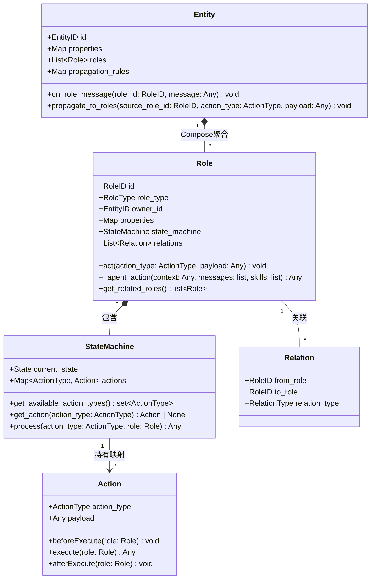
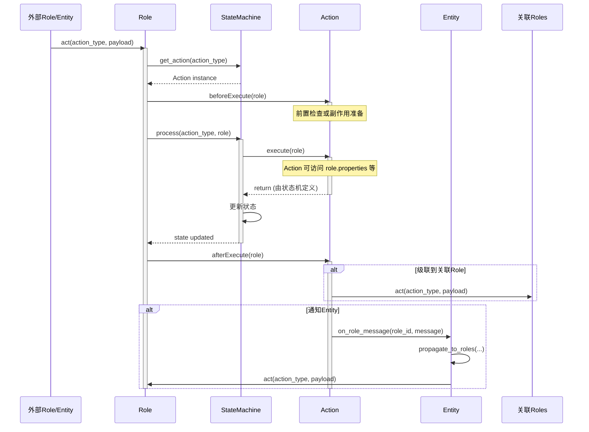
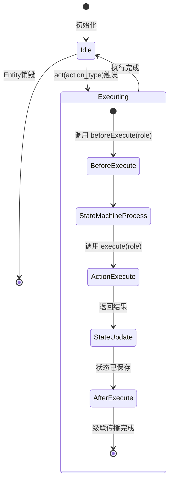
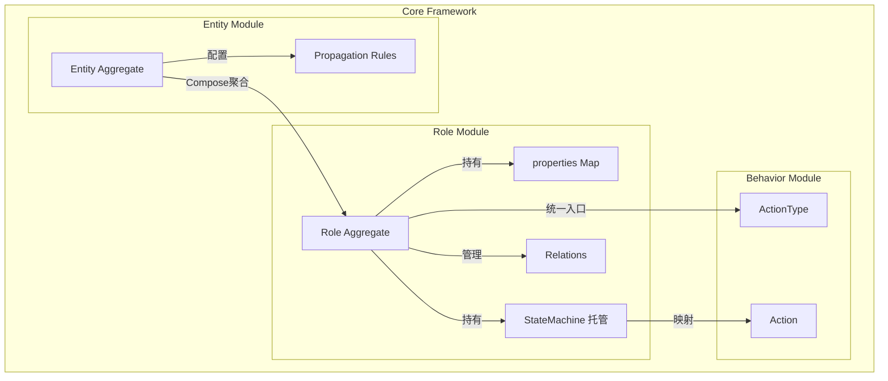
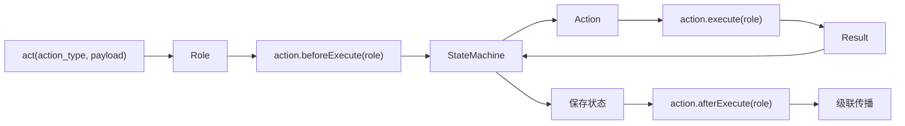

# Phase 1: 核心抽象层基础 - Context

**Gathered:** 2026-04-13
**Status:** Ready for planning

---

<domain>
## Phase Boundary

建立领域无关的核心抽象层，定义双聚合根模型（Entity+Role），实现绝对抽象的实体关系行为传导网络框架基础。

本阶段交付：
- Entity（聚合根，Compose聚合Role，接收Role消息，按规则做内部传播）
- Role（聚合根，含基本属性+扩展properties，持有状态机实例）
- Action（一等行为对象，接收Role参数，含beforeExecute、execute、afterExecute）
- ActionType（Action的key，可扩展）
- StateMachine（上层业务注入，持actions: dict[ActionType, Action]）
- Relation（Role间关联关系）
- StateStorage（存储抽象）

</domain>

---

<decisions>
## Implementation Decisions

### D-01: 双聚合根 + Compose聚合
**决策：** Entity和Role都是聚合根，Entity通过Compose聚合Role

- **Entity作为聚合根**：
  - **Compose聚合**多个Role（直接包含Role对象，不是引用）
  - 统一接收内部Role消息（`on_role_message`）
  - 负责按配置的传播规则，将内部Role消息转发给其他Role
  - 不负责外部消息转发（外部Role通过Relation直接交互）

- **Role作为聚合根**：
  - 独立的生命周期，但由Entity Compose聚合
  - 基本属性（id, owner, role_type等）为不可变标识
  - **可扩展属性** `properties: dict[str, Any]`，用于领域特定状态/参数
  - 自主管理与外部Role的关联关系（`relations: list[Relation]`）
  - 初始化时从配置读取并创建状态机实例，负责保存状态机状态
  - 统一通过 `act(action: Action)` 接受任何调用（无论来自外部Role还是Entity内部转发）

### D-02: Role 的可用 Action 由状态机决定
**决策：** 状态机维护 `actions: dict[ActionType, Action]`，并根据当前状态决定可用的 ActionType

```python
class StateMachine:
    +State current_state
    +dict[ActionType, Action] actions
    +get_available_action_types() -> set[ActionType]
    +get_action(action_type: ActionType) -> Action | None
    +process(action_type: ActionType, role: Role) -> Any
```

- 状态机持有该角色在当前状态下所有可能的 Action 映射
- `get_available_action_types()` 返回当前状态下可用的 ActionType 集合
- Role 的 `act(action)` 接收外部 Action，但通常由调用方确保 ActionType 在可用集合中
- 状态转移规则、Action 映射都是上层业务逻辑，框架层只负责读取和调度

### D-03: Action 是一等对象，接收完整 Role
**决策：** Action 作为完整行为对象，`beforeExecute`、`execute` 和 `afterExecute` 都接收完整 Role 参数

```python
class Action(ABC):
    action_type: ActionType
    payload: Any

    @abstractmethod
    def beforeExecute(self, role: Role) -> None:
        """由Role在执行前调用，可用于前置检查或副作用准备"""
        pass

    @abstractmethod
    def execute(self, role: Role) -> Any:
        """由状态机调用，接收完整Role，可访问其基本属性和properties"""
        pass

    @abstractmethod
    def afterExecute(self, role: Role) -> None:
        """由Role在执行后调用，可通过role.relations获取关联Roles，自主决定级联传播"""
        pass
```

- `execute(role)` 可读取 `role.properties`、`role.state_machine.current_state` 等所有信息
- Action 可以自主决定是否调用 `role._agent_action(...)`
- 执行结果设置在 Action 自身属性上，供后续 `afterExecute` 使用
- `execute` 的返回值由状态机模式的实现决定，框架层不做强制要求

### D-04: Role.act → 状态机 → Action.execute
**决策：** Role 将 ActionType 交给状态机，状态机从中取出对应 Action 并执行

```
外部/Entity -> Role.act(action_type, payload)
                   ↓
              Role 查找 state_machine 中 action_type 对应的 Action
                   ↓
              将 payload 设置到 Action 上（或构造新的 Action 实例）
                   ↓
              Role 调用 action.beforeExecute(role)
                   ↓
              状态机调用 action.execute(role)
                   ↓
              状态机根据返回结果更新状态
                   ↓
              Role 保存新状态
                   ↓
              Role 调用 action.afterExecute(role)
                   ↓
              Action 自行决定级联传播（通知Entity或调用其他Role.act）
```

- `act` 是 Role 的唯一外部入口，签名可为 `act(action_type: ActionType, payload: Any) -> None`
- 状态机是上层业务逻辑，框架层只负责把 ActionType 映射到 Action 并递交给状态机
- 状态转移规则由状态机内部定义，Role 只负责状态存取

### D-05: 智能体接口合并为 _agent_action
**决策：** 为保持智能体思考-行动的封装，提供单一可选接口

```python
def _agent_action(
    self,
    context: Any,
    messages: list[Any],
    skills: list[Any]
) -> Any:
    """智能体核心接口：可选实现，供Action.execute调用"""
    pass
```

- `_think` 和 `_action` 合并为 `_agent_action`
- 这是**可选接口**：简单 Action 的 execute 可以完全由程序逻辑完成，不调用它
- Action.execute(role) 内部可调用 `role._agent_action(...)`，按需使用

### D-06: 级联传播由 Action.afterExecute 主导
**决策：** 框架层只提供传播通道（让Role能调用关联Role，让Entity能被通知），具体传播逻辑由Action实现

- `Role` 在执行完 Action 后，收集自身 `relations` 关联的 Roles
- 调用 `action.afterExecute(role)`
- `Action` 的实现代码里可以：
  - 调用其他 `role.act(action_type, payload)` 做外部级联
  - 调用 `role.owner.on_role_message(...)` 通知 Entity
  - 什么都不做（非传导类Action）

### D-07: Entity 内部传播规则可配置
**决策：** Entity 如何转发内部 Role 的消息给其他 Role，由初始化配置决定

- Entity 初始化时从配置读取 `propagation_rules`
- 规则可以是：固定规则（如：所有消息广播给所有内部Role）、条件规则、或 LLM 驱动规则
- Entity 负责根据规则构造新的 `ActionType + payload`，并调用目标 `Role.act(action_type, payload)`
- 对内的级联与对外的级联对 Role 来说无差别，都是 `act` 调用

### D-08: Relation 作为 Role 的关联边界
**决策：** Role 之间的关联通过 Relation 维护

- `Role` 持有自己的 `relations: list[Relation]`
- Relation 本身不做执行约束，只提供关联查询
- 是否需要 Relation 存在才能执行某 Action，由 Action 的实现或状态机逻辑决定
- 框架层保持领域无关，不预设约束语义

</decisions>

---

<architecture>
## Core Architecture

### 类图



### 时序图：完整的 Act → 状态机 → 传播 流程



### 状态图：Role 生命周期



### 组件图



### 数据流图



</architecture>

---

<specifics>
## 具体设计规范

### Entity 接口定义

```python
class Entity(ABC):
    """聚合根：Compose聚合Role，接收Role消息，按规则做内部传播"""

    @property
    @abstractmethod
    def entity_id(self) -> EntityID: pass

    @property
    @abstractmethod
    def properties(self) -> dict[str, Any]: pass

    @property
    @abstractmethod
    def roles(self) -> list[Role]: pass

    @property
    @abstractmethod
    def propagation_rules(self) -> dict[str, Any]: pass

    @abstractmethod
    def on_role_message(self, role_id: RoleID, message: Any) -> None: pass

    @abstractmethod
    def propagate_to_roles(
        self,
        source_role_id: RoleID,
        action_type: ActionType,
        payload: Any
    ) -> None: pass
```

### Role 接口定义

```python
class Role(ABC):
    """聚合根：含扩展properties，持有状态机，统一通过act接受调用"""

    @property
    @abstractmethod
    def role_id(self) -> RoleID: pass

    @property
    @abstractmethod
    def owner(self) -> Entity: pass

    @property
    @abstractmethod
    def properties(self) -> dict[str, Any]: pass

    @property
    @abstractmethod
    def state_machine(self) -> StateMachine: pass

    @property
    @abstractmethod
    def relations(self) -> list[Relation]: pass

    @abstractmethod
    def act(self, action_type: ActionType, payload: Any) -> None:
        """统一入口：由状态机查找Action并执行，完成后触发afterExecute"""
        pass

    @abstractmethod
    def _agent_action(
        self,
        context: Any,
        messages: list[Any],
        skills: list[Any]
    ) -> Any:
        """可选的智能体接口，供Action.execute调用"""
        pass
```

### Action 接口定义

```python
class Action(ABC):
    """一等行为对象：接收完整Role，含执行逻辑和传播逻辑"""

    action_type: ActionType
    payload: Any

    @abstractmethod
    def beforeExecute(self, role: Role) -> None:
        """由Role在执行前调用，可用于前置检查、副作用准备或拦截"""
        pass

    @abstractmethod
    def execute(self, role: Role) -> Any:
        """由状态机调用，接收完整Role，可访问其属性和properties"""
        pass

    @abstractmethod
    def afterExecute(self, role: Role) -> None:
        """由Role在执行后调用，可通过role.relations获取关联Roles，自主决定级联传播"""
        pass
```

### StateMachine 接口定义

```python
class StateMachine(ABC):
    """上层业务注入的状态机，持Action映射，框架层只负责托管和调度"""

    @property
    @abstractmethod
    def current_state(self) -> State: pass

    @property
    @abstractmethod
    def actions(self) -> dict[ActionType, Action]: pass

    @abstractmethod
    def get_available_action_types(self) -> set[ActionType]:
        """根据当前状态返回可用的ActionType集合"""
        pass

    @abstractmethod
    def get_action(self, action_type: ActionType) -> Action | None:
        """根据ActionType获取对应的Action实例"""
        pass

    @abstractmethod
    def process(self, action_type: ActionType, role: Role) -> Any:
        """接收ActionType和Role，取出Action执行execute，更新状态，返回结果"""
        pass
```

### Entity 转发示例

```python
class Entity:
    def on_role_message(self, role_id: RoleID, message: Any) -> None:
        for rule in self.propagation_rules:
            if rule.matches(role_id, message):
                action_type, payload = rule.build_action(message)
                self.propagate_to_roles(role_id, action_type, payload)

    def propagate_to_roles(
        self,
        source_role_id: RoleID,
        action_type: ActionType,
        payload: Any
    ) -> None:
        for role in self.roles:
            if role.role_id != source_role_id:
                role.act(action_type, payload)
```

</specifics>

---

<canonical_refs>
## Canonical References

### 需求来源
- `.planning/REQUIREMENTS.md` §核心抽象层 (CORE)
- `.planning/PROJECT.md` §Context §目标架构愿景

### 设计原则
- `.planning/codebase/CONVENTIONS.md` — Python类型注解、ABC抽象基类规范

</canonical_refs>

---

<deferred>
## Deferred Ideas

None — discussion stayed within phase scope
</deferred>

---

*Phase: 01-核心抽象层基础*
*Updated: 2026-04-13*
